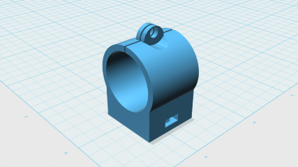
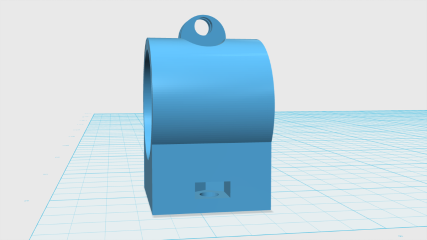
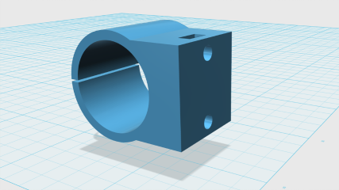
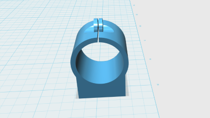
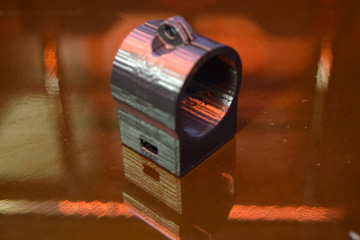
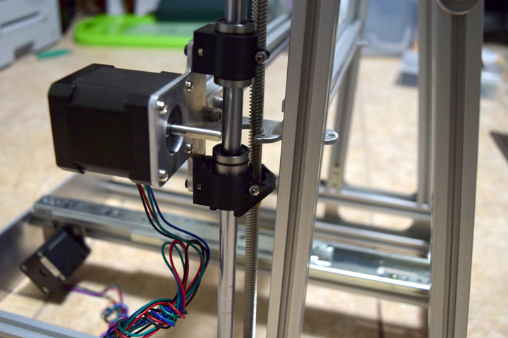

# openscad-parts

After cloning, run the following to pull in the linked submodule(s):

```
git submodule init
git submodule update
```

Alternatively, use this clone command right from the start:

`git clone --recursive https://github.com/skylogic004/openscad-parts.git`

## LM10UU holder (for MendelMax 2.0 3D printer)
Use file [LM10UU-holder-v2.scad](LM10UU-holder.scad) or [LM10UU-holder-v2.stl](LM10UU-holder.stl).
Can be customized using OpenSCAD (has parameters for distance between screws, various heights/widths, type of screw (M3, M5, etc), diameter of holder (can be used for LM12UU for example).

For more information, see [my blog post](http://projects.skylogic.ca/blog/?p=168)

### Version 2 screenshots:








### Version 1 screenshots:


